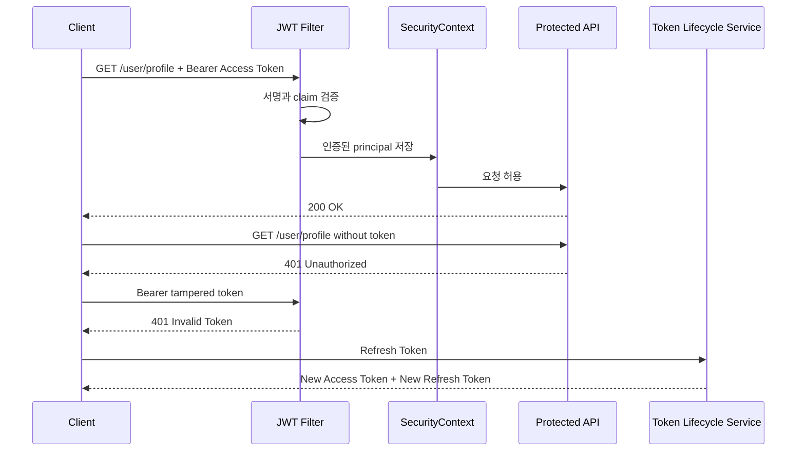

# Phase 1 - JWT Dual Token Authentication

## 요약

Phase 1은 Access Token과 Refresh Token을 분리하고, Protected API 접근이 JWT 인증 정책으로 제어되는지 증명한다.

| 항목 | 내용 |
| --- | --- |
| Phase | Phase 1 - JWT Dual Token Authentication |
| 목표 | Access Token으로 Protected API 접근을 인증하고, Refresh Token으로 새 토큰 쌍을 발급한다 |
| 결과 | PASS |
| 검증일 | 2026-05-21 |
| 검증 명령 | `./gradlew.bat test --tests org.example.security.jwt.JwtAuthenticationFilterTest --tests org.example.security.jwt.JwtSecurityIntegrationTest --tests org.example.security.token.TokenLifecycleServiceImplTest` |

## Evidence Matrix

| 보안 주장 | 재현 시나리오 | 기대 결과 | 증거 테스트 | 결과 |
| --- | --- | --- | --- | --- |
| Access Token이 Protected API 인증을 만든다 | 유효한 Bearer Access Token으로 Protected API 호출 | 인증된 `SecurityContext` 생성 또는 200 OK | `JwtAuthenticationFilterTest.doFilter_setsAuthentication_whenBearerTokenIsValid`, `JwtSecurityIntegrationTest.returnsOk_whenUserTokenAccessesUserEndpoint` | PASS |
| Access Token이 없으면 Protected API 접근이 거부된다 | Authorization header 없이 Protected API 호출 | 401 Unauthorized | `JwtSecurityIntegrationTest.returnsUnauthorized_whenTokenMissing` | PASS |
| 변조된 Access Token은 거부된다 | 서명이 깨진 JWT 사용 | JWT 예외 또는 401 Unauthorized | `JwtAuthenticationFilterTest.doFilter_throwsJwtException_whenTokenIsInvalid`, `JwtSecurityIntegrationTest.returnsUnauthorized_whenTokenIsTampered` | PASS |
| Refresh Token으로 새 토큰 쌍을 발급할 수 있다 | 유효한 Refresh Token 사용 | 새 Access Token과 새 Refresh Token 발급 | `TokenLifecycleServiceImplTest.rotate_replacesActiveRefreshToken` | PASS |

## 인증 흐름

## 이 evidence가 증명하는 것

- Protected API는 유효한 Access Token이 있을 때만 인증된 요청으로 처리된다.
- Access Token이 없으면 인증 경계를 넘지 못하고 401 응답을 받는다.
- 변조된 JWT는 인증에 사용되지 못한다.
- Refresh Token은 Access Token과 분리되어 새 토큰 쌍 발급에 사용된다.

Phase 1은 Redis 저장, Logout Blacklist, Refresh Token 재사용 탐지까지 증명하지 않는다. 해당 항목은 Phase 2와 Phase 3 evidence에서 다룬다.
