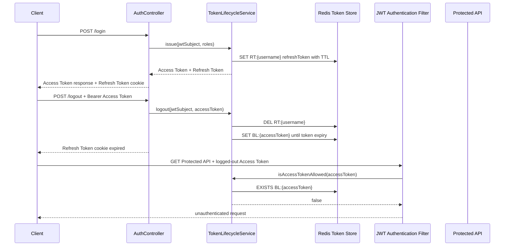

# Phase 2 - Redis Token Store + Logout Blacklist

## 요약

Phase 2는 Refresh Token을 Redis 기반 Token Store에 저장하고, 로그아웃된 Access Token을 Logout Blacklist로 차단하는지 증명한다.

| 항목 | 내용 |
| --- | --- |
| Phase | Phase 2 - Redis Token Store + Logout Blacklist |
| 목표 | Refresh Token은 Redis에 저장하고, 로그아웃된 Access Token은 남은 만료 시간 동안 재사용하지 못하게 한다 |
| 결과 | PASS |
| 검증일 | 2026-05-22 |
| 검증 명령 | `./gradlew.bat test` |
| 완료 판정 원본 | `docs/evidence.md`의 Phase 2 Evidence Matrix |

## Evidence Matrix

| 보안 주장 | 재현 시나리오 | 기대 결과 | 증거 테스트 | 결과 |
| --- | --- | --- | --- | --- |
| Refresh Token이 Redis에 저장된다 | 로컬 로그인이 성공한다 | `RT:{username}`이 저장된다 | `TokenLifecycleServiceImplTest.issue_storesRefreshTokenForJwtSubject` | PASS |
| Refresh Token에 Redis TTL이 설정된다 | 토큰이 저장된다 | Redis TTL이 0보다 크다 | `TokenRedisRepositoryTest.saveRefreshToken_setsTtl` | PASS |
| 로그아웃하면 Refresh Token이 삭제된다 | 로그아웃이 성공한다 | `RT:{username}`이 삭제된다 | `TokenLifecycleServiceImplTest.logout_removesRefreshTokenAndBlacklistsAccessToken` | PASS |
| 로그아웃하면 Access Token이 블랙리스트에 등록된다 | 로그아웃이 성공한다 | 토큰 만료 시점까지 `BL:{accessToken}`이 저장된다 | `TokenLifecycleServiceImplTest.logout_removesRefreshTokenAndBlacklistsAccessToken` | PASS |
| 블랙리스트에 등록된 Access Token은 거부된다 | 로그아웃된 Access Token으로 Protected API를 호출한다 | `SecurityContext`가 인증 상태가 되지 않는다 | `JwtAuthenticationFilterTest.doFilter_doesNotAuthenticate_whenAccessTokenIsBlacklisted` | PASS |
| PostgreSQL RefreshToken 모델이 제거된다 | JPA Refresh Token이 필요한 코드 경로가 없다 | 운영 코드에서 `RefreshTokenRepository` 의존성이 없다 | 컴파일 및 테스트 스위트 | PASS |

## 인증 흐름

## 이 evidence가 증명하는 것

- Refresh Token은 PostgreSQL JPA 모델이 아니라 Redis Token Store의 `RT:{username}` 키로 관리된다.
- Refresh Token 저장에는 TTL이 설정되어 토큰 생명주기와 저장소 생명주기가 함께 움직인다.
- 로그아웃은 Refresh Token 삭제와 Access Token 블랙리스트 등록을 모두 수행한다.
- 로그아웃된 Access Token은 JWT 서명과 만료 시간이 아직 유효하더라도 Protected API 인증에 사용할 수 없다.
- 운영 코드에서 `RefreshTokenRepository` 의존성이 제거되어 PostgreSQL RefreshToken 모델이 현재 Token Store 정책에 남아 있지 않다.

## Phase 경계

Phase 2는 Redis Token Store와 Logout Blacklist의 등록 및 차단을 증명한다. Refresh Token 재사용 탐지, 보안 감사 이벤트, Redis 장애 정책은 각각 Phase 3, Phase 5, Phase 9 evidence에서 다룬다.
