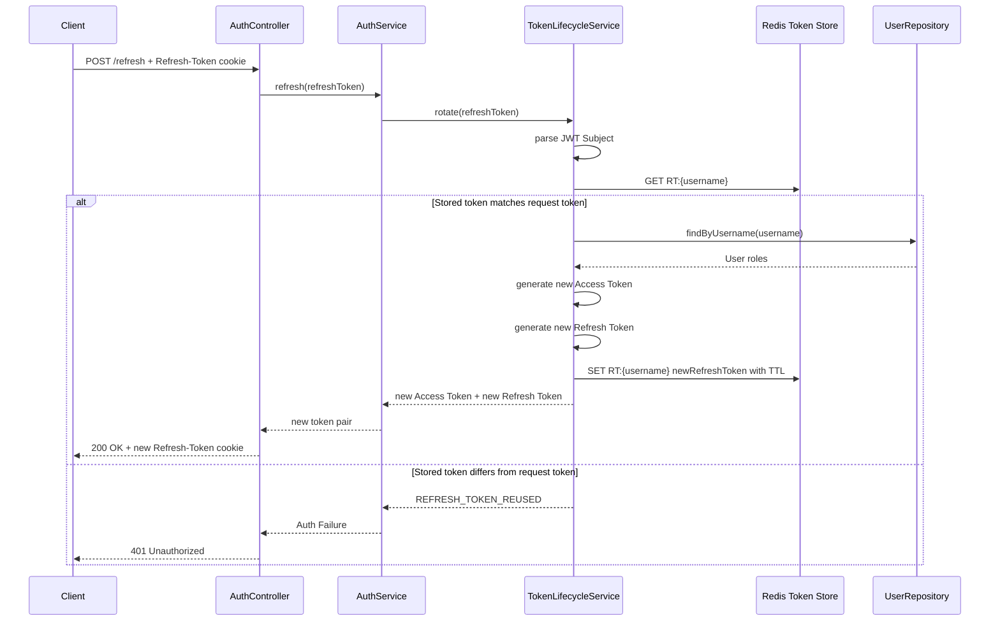

# Phase 3 - Refresh Token Rotation & Reuse Detection

## 요약

Phase 3는 Refresh Token을 사용할 때마다 새 Refresh Token으로 교체하고, 이전 Refresh Token 재사용을 탈취 의심 시나리오로 탐지해 거부하는지 증명한다.

| 항목 | 내용 |
| --- | --- |
| Phase | Phase 3 - Refresh Token Rotation & Reuse Detection |
| 목표 | Refresh Token 사용 시 기존 저장 토큰을 새 토큰으로 회전시키고, 이전 Refresh Token 재사용을 `REFRESH_TOKEN_REUSED` 실패로 차단한다 |
| 결과 | PASS |
| 검증일 | 2026-05-26 |
| 검증 명령 | `./gradlew.bat test --tests org.example.security.token.TokenLifecycleServiceImplTest --tests org.example.service.AuthServiceImplTest --tests org.example.controller.AuthControllerTest` |
| 완료 판정 원본 | `docs/evidence.md`의 Phase 3 Evidence Matrix |

## Evidence Matrix

| 보안 주장 | 재현 시나리오 | 기대 결과 | 증거 테스트 | 결과 |
| --- | --- | --- | --- | --- |
| Refresh Token은 사용 시 회전된다 | 유효한 Refresh Token이 한 번 사용된다 | 새 Refresh Token이 기존 저장 토큰을 대체한다 | `TokenLifecycleServiceImplTest.rotate_replacesActiveRefreshToken` | PASS |
| 이전 Refresh Token은 재사용할 수 없다 | 이전 토큰이 저장된 토큰과 다르다 | `REFRESH_TOKEN_REUSED` 인증 실패 | `TokenLifecycleServiceImplTest.rotate_rejectsReusedRefreshToken` | PASS |

## 인증 흐름

## 이 evidence가 증명하는 것

- Refresh Token은 한 번 사용된 뒤 같은 JWT Subject의 활성 Refresh Token을 새 값으로 대체한다.
- Token Store에는 현재 활성 Refresh Token 하나만 남기므로, 이전 Refresh Token은 더 이상 정상 refresh 수단이 아니다.
- 요청 Refresh Token이 Redis에 저장된 활성 토큰과 다르면 `REFRESH_TOKEN_REUSED` Auth Failure로 구분된다.
- Refresh Token 재사용은 단순 만료나 누락과 다른 실패 조건으로 표현되어, 이후 Security Audit Event로 확장할 수 있다.
- `/refresh` 요청은 컨트롤러와 서비스 계층을 거쳐 `TokenLifecycleService.rotate(...)` 정책을 사용한다.

## Phase 경계

Phase 3는 Refresh Token Rotation과 Reuse Detection을 증명한다. 재사용 탐지 이벤트를 감사 로그로 남기는 정책은 Phase 5 evidence에서 다루고, Redis 장애 시 refresh를 어떻게 실패시킬지는 Phase 9 evidence에서 다룬다.
