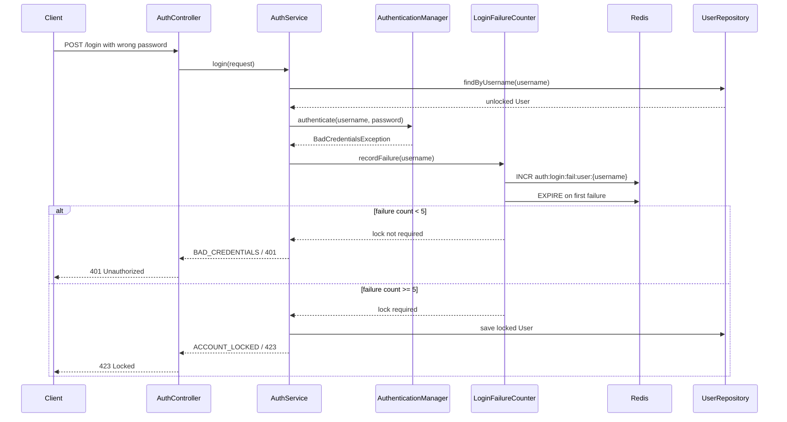
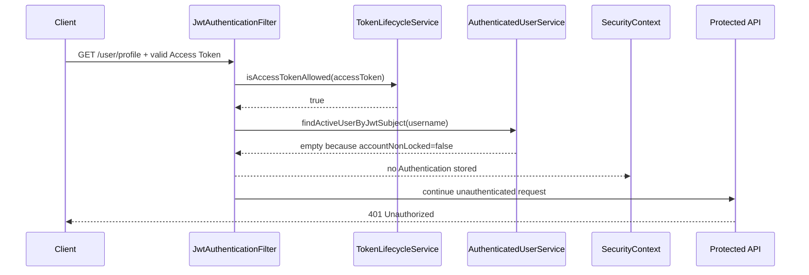
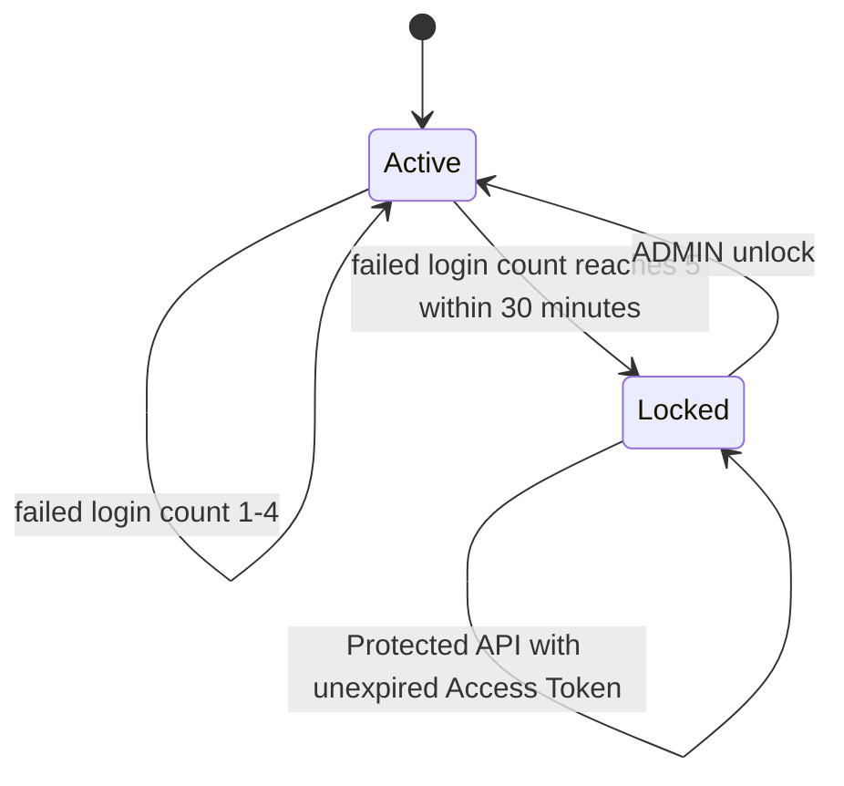
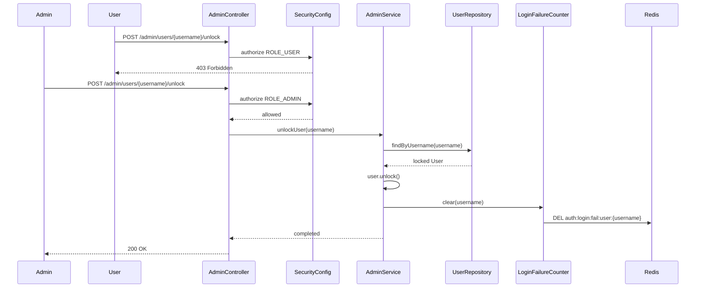

# Phase 4 - Account Lock & Admin Recovery

## 요약

Phase 4는 반복된 로그인 실패가 User의 인증 가능 상태를 실제로 잠그고, 잠긴 User는 기존 Access Token이 아직 만료되지 않았더라도 Protected API에 접근할 수 없으며, 복구는 ADMIN 권한으로만 수행된다는 것을 증명한다.

| 항목 | 내용 |
| --- | --- |
| Phase | Phase 4 - Account Lock & Admin Recovery |
| 목표 | username 기준 로그인 실패를 Redis 단기 카운터로 추적하고, 임계값 도달 시 DB User 상태를 잠근 뒤 ADMIN만 복구할 수 있게 한다 |
| 결과 | PASS |
| 검증일 | 2026-05-27 |
| 검증 명령 | `rtk proxy ./gradlew.bat test --tests org.example.service.AuthServiceImplTest --tests org.example.security.jwt.JwtAuthenticationFilterTest --tests org.example.service.AdminServiceImplTest --tests org.example.controller.AdminControllerSecurityTest` |
| 추가 검증 명령 | `rtk proxy ./gradlew.bat test --tests org.example.controller.AdminControllerSecurityIntegrationTest` |
| 완료 판정 원본 | `docs/evidence.md`의 Phase 4 Evidence Matrix |

## Evidence Matrix

| 보안 주장 | 재현 시나리오 | 기대 결과 | 증거 테스트 | 결과 |
| --- | --- | --- | --- | --- |
| 잘못된 비밀번호가 반복되면 계정이 잠긴다 | username 기준 30분 안에 로그인 5회 실패 | 423 Locked와 DB 계정 잠금 | `AuthServiceImplTest.login_locksUser_afterFiveFailures` | PASS |
| 잠긴 계정은 로그인할 수 없다 | 잠금 후 올바른 비밀번호로 로그인 | 423 Locked | `AuthServiceImplTest.login_throwsLockedException_whenUserLocked` | PASS |
| 잠긴 계정은 기존 Access Token을 사용할 수 없다 | 잠금 후 기존 토큰으로 Protected API 호출 | `SecurityContext`가 인증 상태가 되지 않는다 | `JwtAuthenticationFilterTest.doFilter_doesNotAuthenticate_whenUserIsLocked` | PASS |
| ADMIN은 계정 잠금을 해제할 수 있다 | ADMIN이 사용자의 잠금을 해제한다 | 계정 잠금이 해제된다 | `AdminServiceImplTest.unlockUser_unlocksLockedUser` | PASS |
| USER는 계정 잠금을 해제할 수 없다 | USER가 admin endpoint를 호출한다 | 403 Forbidden | `AdminControllerSecurityIntegrationTest.userCannotUnlockAccount_withProductionSecurityConfig` | PASS |

## 정책 요약

- 로그인 실패 카운터는 Redis key `auth:login:fail:user:{username}`에 저장한다.
- 카운터 윈도우는 30분이며, 첫 실패 때 TTL을 설정한다.
- 30분 안에 5번째 실패가 발생하면 DB의 `users.accountNonLocked=false`로 최종 Account Lock 상태를 저장한다.
- 실패 응답은 남은 시도 횟수를 노출하지 않는다.
- Unknown User와 wrong password는 같은 credential failure 응답으로 처리한다.
- ADMIN unlock은 DB Account Lock을 해제하고 Redis 실패 카운터를 삭제한다.

## 인증 및 잠금 흐름

## Account Lock 상태 모델

## 복구 흐름

## 이 evidence가 증명하는 것

- 계정 잠금은 단순한 로그인 실패 메시지가 아니라 DB User 상태 변경으로 남는다.
- Redis 실패 카운터는 최종 잠금 상태가 아니라 30분 윈도우 안의 단기 판단 근거로만 사용된다.
- 잠긴 User는 올바른 비밀번호를 입력해도 새 토큰을 받을 수 없다.
- Access Token이 서명과 만료 조건을 만족해도, 현재 User 상태가 잠겨 있으면 Protected API 인증이 만들어지지 않는다.
- 계정 복구는 ADMIN 권한 경계 뒤에 있으며, USER는 unlock endpoint를 호출해도 서비스 로직에 도달하지 못한다.

## Phase 경계

Phase 4는 Account Lock과 Admin Recovery의 필수 방어 시나리오만 증명한다. IP 기반 abuse throttling, CAPTCHA, 로그인 지연, Gmail 또는 email-code 기반 self-service unlock은 Phase 4 완료 기준이 아니라 후속 hardening 항목이다.

보안 감사 이벤트로 로그인 실패, 계정 잠금, 관리자 복구를 기록하는 정책은 Phase 5 evidence에서 다룬다. Redis 장애 시 로그인 실패 카운터와 인증 흐름을 어떻게 실패시킬지는 Phase 9 Redis Failure Policy evidence에서 다룬다.
