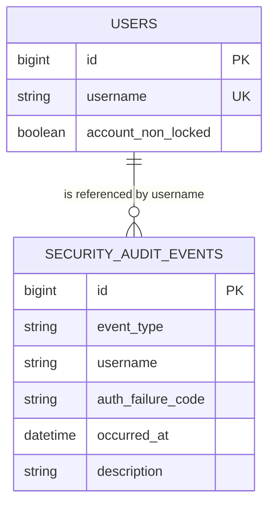
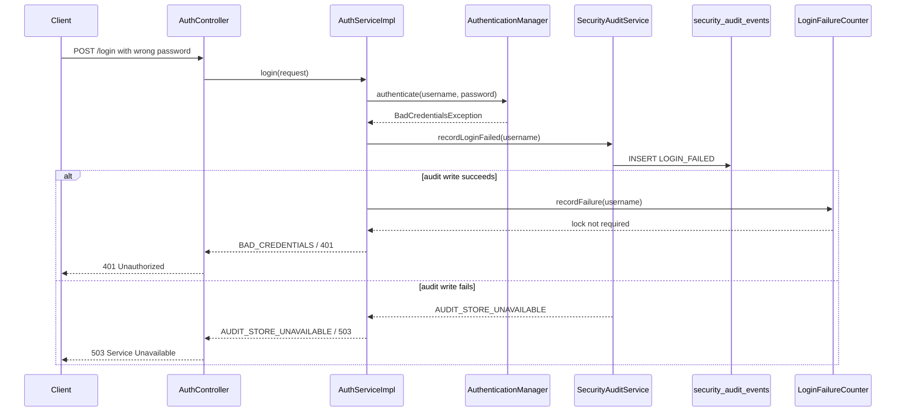
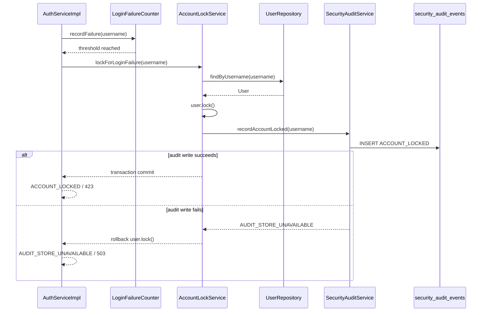
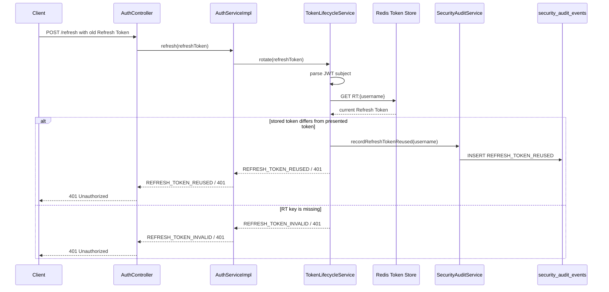

# Phase 5 - Security Audit Event

## 요약

Phase 5는 인증 실패와 토큰 재사용 같은 보안상 의미 있는 사건이 단순 예외 응답으로 사라지지 않고, 재현 가능한 Security Audit Event로 DB에 남는다는 것을 증명한다.

| 항목 | 내용 |
| --- | --- |
| Phase | Phase 5 - Security Audit Event |
| 목표 | 로그인 실패, Account Lock, Refresh Token 재사용을 구조화된 감사 이벤트로 저장한다 |
| 결과 | PASS |
| 검증일 | 2026-06-10 |
| 검증 명령 | `rtk gradlew test --rerun-tasks --tests org.example.security.audit.SecurityAuditServiceTest --tests org.example.repository.SecurityAuditEventRepositoryTest --tests org.example.service.AuthServiceImplTest --tests org.example.security.account.AccountLockServiceImplTest --tests org.example.security.account.AccountLockServiceIntegrationTest --tests org.example.security.account.AccountLockServiceRollbackIntegrationTest --tests org.example.security.token.TokenLifecycleServiceImplTest --tests org.example.controller.AuthControllerTest` |
| 완료 판정 원본 | `docs/evidence.md`의 Phase 5 Evidence Matrix |

## Evidence Matrix

| 보안 주장 | 재현 시나리오 | 기대 결과 | 증거 테스트 | 결과 |
| --- | --- | --- | --- | --- |
| 로그인 실패가 감사된다 | 잘못된 비밀번호로 로그인 | `LOGIN_FAILED` Security Audit Event가 저장되고, 감사 저장 실패 시 `AUDIT_STORE_UNAVAILABLE` 503으로 fail-closed 된다 | `SecurityAuditServiceTest.recordLoginFailed_savesLoginFailedEvent`, `AuthServiceImplTest.login_recordsLoginFailedAudit_beforeFailureCounter`, `AuthControllerTest.returns503WithAuditStoreUnavailableCode_whenAuditStoreUnavailableOnLogin` | PASS |
| 계정 잠금이 감사된다 | 실패 임계값 도달 | User lock과 `ACCOUNT_LOCKED` Security Audit Event가 같은 트랜잭션으로 저장되고, 감사 저장 실패 시 User lock이 rollback된다 | `AccountLockServiceImplTest.lockForLoginFailure_locksUserAndRecordsAudit`, `AccountLockServiceIntegrationTest.lockForLoginFailure_commitsUserLockAndAuditTogether`, `AccountLockServiceRollbackIntegrationTest.lockForLoginFailure_rollsBackUserLock_whenAuditFails` | PASS |
| Refresh Token 재사용이 감사된다 | 이전 Refresh Token 재사용 | `REFRESH_TOKEN_REUSED` Security Audit Event가 저장되고, 감사 저장 실패 시 `AUDIT_STORE_UNAVAILABLE` 503으로 fail-closed 된다 | `TokenLifecycleServiceImplTest.rotate_recordsAuditAndRejects_whenRefreshTokenIsReused`, `TokenLifecycleServiceImplTest.rotate_throwsAuditStoreUnavailable_whenRefreshReuseAuditFails`, `AuthControllerTest.returns503WithAuditStoreUnavailableCode_whenAuditStoreUnavailableOnRefresh` | PASS |

## 정책 요약

- Security Audit Event는 애플리케이션 로그 문자열이 아니라 DB의 `security_audit_events` 테이블에 저장되는 구조화된 기록이다.
- Phase 5의 감사 대상은 `LOGIN_FAILED`, `ACCOUNT_LOCKED`, `REFRESH_TOKEN_REUSED` 세 가지 실패 또는 위험 신호다.
- 감사 저장은 동기식으로 수행한다.
- 필수 감사 저장이 실패하면 원래 인증 실패 응답 대신 `AUDIT_STORE_UNAVAILABLE`과 HTTP 503을 반환한다.
- `LOGIN_FAILED`와 `REFRESH_TOKEN_REUSED`는 별도 트랜잭션으로 저장한다.
- `ACCOUNT_LOCKED`는 User lock 상태 변경과 감사 이벤트 저장을 같은 트랜잭션으로 묶는다.
- 감사 이벤트에는 raw Access Token 또는 raw Refresh Token을 저장하지 않는다.
- Refresh Token 재사용 감사는 Redis에 active RT가 존재하지만 요청 RT와 값이 다른 경우에만 수행한다.
- Redis에 `RT:{username}` key가 없는 경우는 만료, 로그아웃, 삭제, 미존재를 구분할 수 없으므로 `REFRESH_TOKEN_INVALID`로 처리하고 재사용 감사 대상에서 제외한다.

## 감사 이벤트 저장 모델



Phase 5에서는 물리적으로 분리된 audit DB를 만들지 않는다. 기존 애플리케이션 PostgreSQL 안에 `security_audit_events` 테이블을 추가해 evidence를 검증한다. 운영 환경에서 감사 로그 보존, 검색, 분리 저장이 필요해지면 별도 DB 또는 이벤트 파이프라인으로 확장할 수 있다.

## 로그인 실패 감사 흐름



이 흐름이 증명하는 핵심은 감사 저장이 실패 카운터 증가보다 먼저 일어난다는 점이다. `LOGIN_FAILED` 저장이 실패하면 실패 카운터도 증가하지 않고, 서비스는 fail-closed로 503을 반환한다.

## 계정 잠금 감사 흐름



`ACCOUNT_LOCKED`는 단순 실패 기록이 아니라 User 상태 변경을 설명하는 사건이다. 따라서 `users.accountNonLocked=false`와 `ACCOUNT_LOCKED` 감사 이벤트는 같은 트랜잭션에서 commit되거나 함께 rollback되어야 한다. 이 정책은 `AccountLockServiceIntegrationTest`와 `AccountLockServiceRollbackIntegrationTest`로 검증했다.

## Refresh Token 재사용 감사 흐름



Refresh Token 재사용 감사는 Redis에 active RT가 있는 경우에만 의미가 있다.

```text
RT:{username} exists and stored token != presented token
-> REFRESH_TOKEN_REUSED audit
```

반대로 `RT:{username}` key가 없으면 로그아웃, TTL 만료, 강제 삭제, 저장된 적 없는 토큰을 구분할 수 없다. 이 경우는 재사용으로 단정하지 않고 `REFRESH_TOKEN_INVALID`로 처리한다.

## 이 evidence가 증명하는 것

- 보안 실패가 단순 예외나 로그 메시지로만 끝나지 않고, 구조화된 Security Audit Event로 남는다.
- 로그인 실패는 `LOGIN_FAILED` 이벤트로 기록되고, 기록 실패 시 실패 카운터 증가 전에 중단된다.
- Account Lock은 DB User 상태 변경과 `ACCOUNT_LOCKED` 감사 기록이 같은 트랜잭션 경계 안에서 처리된다.
- Refresh Token 재사용은 active RT와 요청 RT가 다른 경우에만 `REFRESH_TOKEN_REUSED` 이벤트로 기록된다.
- 감사 저장소 장애는 인증 응답을 정상 실패처럼 위장하지 않고 `AUDIT_STORE_UNAVAILABLE` 503으로 드러낸다.
- 클라이언트에는 감사 DB 장애의 내부 구조를 노출하지 않고, 안정적인 Auth Failure code만 반환한다.

## Phase 경계

Phase 5는 실패 또는 위험 신호의 감사 기록을 증명한다. 정상 로그인 성공, 정상 Refresh Token Rotation, 로그아웃 성공, 관리자 감사 조회 API, 비동기 감사 이벤트 처리, Kafka 또는 Redis Stream 기반 이벤트 파이프라인은 Phase 5 완료 기준이 아니다.

Phase 6은 OAuth2 로그인 후 서비스 JWT 발급을 다룬다. Phase 7은 OAuth2 성공 후 Access Token을 URL에 직접 싣지 않고 One-time Code Exchange로 교환하는 정책을 다룬다.
