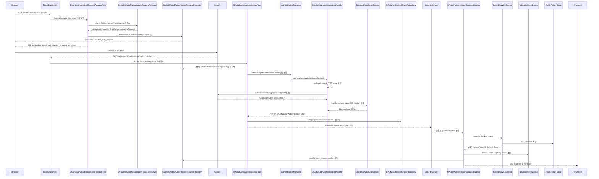
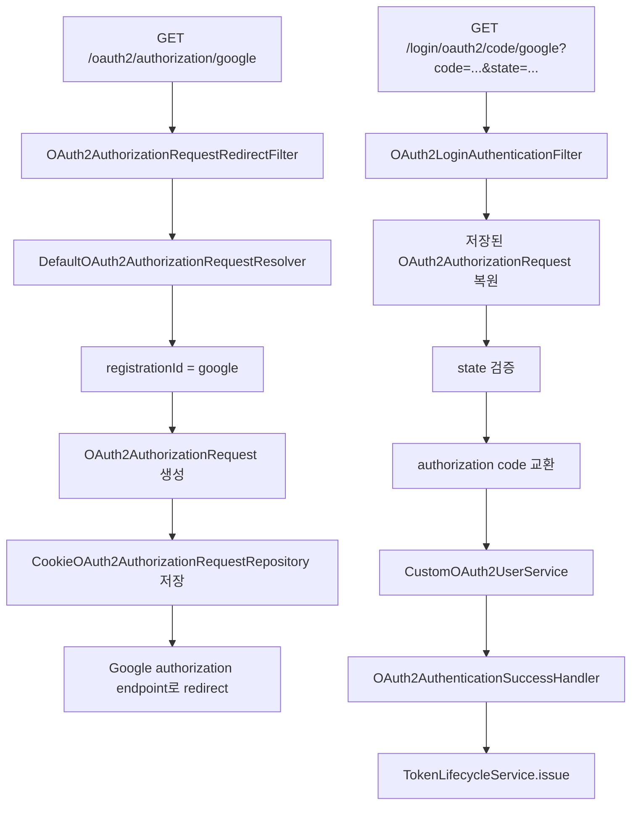
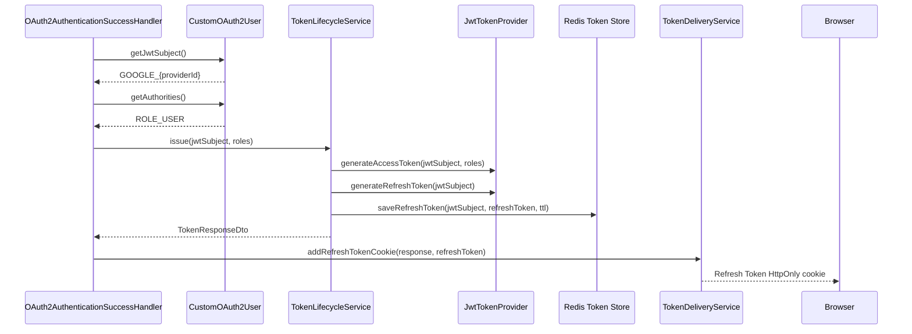

# Phase 6 - OAuth2 Service JWT Issuing

## 요약

Phase 6은 Google OAuth2 로그인이 성공했을 때 외부 Provider 토큰을 그대로 서비스 인증에 쓰지 않고, Local login과 같은 서비스 소유 Access Token/Refresh Token을 발급한다는 것을 증명한다.

| 항목 | 내용 |
| --- | --- |
| Phase | Phase 6 - OAuth2 Service JWT Issuing |
| 목표 | OAuth2 인증 성공 후 서비스 JWT를 발급하고, Local login과 같은 Token Store 정책을 사용한다 |
| 결과 | PASS |
| 검증일 | 2026-05-20 |
| 검증 명령 | `./gradlew.bat test` |
| 완료 판정 원본 | `docs/evidence.md`의 Phase 6 Evidence Matrix |
| 상세 흐름 참고 | `oauth2-flow.md` |

## Evidence Matrix

| 보안 주장 | 재현 시나리오 | 기대 결과 | 증거 테스트 | 결과 |
| --- | --- | --- | --- | --- |
| OAuth2 로그인은 서비스 Access Token을 발급한다 | OAuth2 success handler가 실행된다 | 서비스 JWT가 생성된다 | `OAuth2AuthenticationSuccessHandlerTest` | PASS |
| OAuth2 로그인은 서비스 Refresh Token을 발급한다 | OAuth2 success handler가 실행된다 | Refresh Token cookie가 설정된다 | `OAuth2AuthenticationSuccessHandlerTest` | PASS |
| OAuth2 로그인과 로컬 로그인은 Token Store 정책을 공유한다 | OAuth2 success handler가 실행된다 | 토큰 발급이 `TokenLifecycleService`를 거친다 | `OAuth2AuthenticationSuccessHandlerTest.onAuthenticationSuccess_issuesTokensThroughTokenLifecycleServiceAndRedirects` | PASS |

## OAuth2 로그인 흐름

이 흐름에서 Google은 사용자를 확인하는 외부 인증 Provider다. 서비스의 Protected API 인증은 Google provider access token이 아니라 `TokenLifecycleService`가 발급한 서비스 Access Token으로 처리한다.

중요한 점은 이 흐름 전체를 프로젝트 코드가 직접 컨트롤러로 구현한 것이 아니라는 점이다. `SecurityConfig`에서 `.oauth2Login(...)`을 선언하면 Spring Security가 OAuth2 시작 요청과 callback 요청을 처리하는 필터들을 `SecurityFilterChain`에 자동으로 넣는다. 프로젝트 코드는 그 자동 흐름 중 필요한 확장 지점만 제공한다.

| 구간 | Spring Security가 자동으로 하는 일 | 프로젝트가 제공한 확장 |
| --- | --- | --- |
| OAuth2 시작 요청 | `OAuth2AuthorizationRequestRedirectFilter`가 `/oauth2/authorization/google`을 감지하고 Google authorization endpoint로 보낼 `OAuth2AuthorizationRequest`를 만든다 | `CookieOAuth2AuthorizationRequestRepository`가 기본 세션 저장소 대신 request/state를 cookie에 저장한다 |
| Provider 식별 | `DefaultOAuth2AuthorizationRequestResolver`가 `/oauth2/authorization/{registrationId}`에서 `google`을 추출하고 `ClientRegistration`을 찾는다 | `application.yml`의 `spring.security.oauth2.client.registration.google` 설정이 `ClientRegistration`의 입력이 된다 |
| OAuth2 Callback 수신 | `OAuth2LoginAuthenticationFilter`가 `/login/oauth2/code/*` 요청을 잡고 `code`, `state`를 인증 요청으로 바꾼다 | `redirectionEndpoint.baseUri("/login/oauth2/code/*")`로 callback 수신 경로를 명시한다 |
| OAuth2 인증 처리 | `AuthenticationManager`와 OAuth2 인증 provider가 state를 검증하고, authorization code를 Google token endpoint에 보내 provider access token을 받는다 | state 복원을 위해 cookie-backed repository가 저장된 `OAuth2AuthorizationRequest`를 돌려준다 |
| 사용자 정보 조회 | Spring Security OAuth2 Login 흐름이 provider access token으로 UserInfo 조회를 위임한다 | `CustomOAuth2UserService`가 Google UserInfo를 서비스 `User`로 연결하거나 자동 가입한다 |
| 인증 결과 저장 | `AbstractAuthenticationProcessingFilter`의 성공 흐름이 `OAuth2AuthenticationToken`을 현재 요청의 `SecurityContext`에 저장하고 success handler를 호출한다 | `OAuth2AuthenticationSuccessHandler`가 전달받은 Authentication으로 서비스 JWT를 발급한다 |
| Provider token 보관 | `OAuth2AuthorizedClientRepository`가 Google provider access token을 저장할 수 있다 | 현재 서비스 API 인증은 이 토큰을 쓰지 않고, 서비스 Access Token을 새로 발급한다 |

## Spring Security 필터 경계

OAuth2 로그인 요청은 컨트롤러가 아니라 Spring Security Filter Chain에서 먼저 처리된다.

`OAuth2AuthorizationRequestRedirectFilter`는 `/oauth2/authorization/{registrationId}` 형태의 시작 요청을 처리한다. 현재 프로젝트에서 `{registrationId}`는 `application.yml`의 `spring.security.oauth2.client.registration.google`에 대응하는 `google`이다.

`OAuth2LoginAuthenticationFilter`는 `/login/oauth2/code/*` callback을 처리한다. 이 필터는 `doFilter`를 직접 구현하기보다 부모 클래스인 `AbstractAuthenticationProcessingFilter`의 `doFilter` 흐름 안에서 `attemptAuthentication(...)`을 실행한다. `attemptAuthentication(...)`은 callback parameter를 읽고, cookie에서 복원한 `OAuth2AuthorizationRequest`와 묶어 `OAuth2LoginAuthenticationToken`을 만든 뒤 `AuthenticationManager`에게 넘긴다.

그 다음 state 비교, authorization code 교환, provider access token 획득, UserInfo 조회, `OAuth2AuthenticationToken` 생성은 Spring Security OAuth2 Login 내부 provider 흐름에서 진행된다. 이 과정이 끝나면 성공한 Authentication이 현재 요청의 `SecurityContext`에 올라가고, 프로젝트가 등록한 `OAuth2AuthenticationSuccessHandler`가 실행된다.

## 서비스 JWT 발급 경계

Phase 6의 핵심은 OAuth2 인증 성공 이후 토큰 발급 책임이 Spring Security provider token에서 서비스 JWT 정책으로 넘어온다는 점이다.

`jwtSubject`는 Google의 email이 아니라 서비스 User의 username이다. 현재 OAuth2 User username은 `GOOGLE_{providerId}` 형식이며, Redis Token Store의 active Refresh Token key도 이 subject를 기준으로 관리된다.

## 핵심 클래스와 책임

| 클래스 | 책임 |
| --- | --- |
| `SecurityConfig` | OAuth2 Login 설정, stateless session 정책, 공개 OAuth2 경로, success/failure handler 연결 |
| `FilterChainProxy`, `SecurityFilterChain` | 요청을 Spring Security 필터 체인에 태우고, 등록된 필터를 순서대로 실행 |
| `OAuth2AuthorizationRequestRedirectFilter` | `/oauth2/authorization/google` 요청을 Google authorization endpoint로 redirect |
| `DefaultOAuth2AuthorizationRequestResolver` | `/oauth2/authorization/{registrationId}`에서 `registrationId`를 추출하고 `OAuth2AuthorizationRequest` 생성 |
| `CookieOAuth2AuthorizationRequestRepository` | 세션 대신 `oauth2_auth_request` cookie에 `OAuth2AuthorizationRequest`와 state를 저장하고 callback 때 복원 |
| `OAuth2LoginAuthenticationFilter` | `/login/oauth2/code/*` callback의 `code`, `state`를 인증 요청으로 변환 |
| `AbstractAuthenticationProcessingFilter` | callback 경로 매칭, `attemptAuthentication(...)` 호출, 성공 Authentication의 `SecurityContext` 저장, success handler 호출 |
| `AuthenticationManager` | `OAuth2LoginAuthenticationToken`을 처리할 OAuth2 authentication provider에게 인증 위임 |
| `OAuth2LoginAuthenticationProvider` 계열 | state 검증, authorization code 교환, provider access token 획득, UserInfo 조회 흐름 수행 |
| `OAuth2AuthorizedClientRepository` | Google provider access token과 provider refresh token을 저장할 수 있는 Spring Security OAuth2 Client 저장소 |
| `CustomOAuth2UserService` | Google UserInfo를 읽고 provider/providerId 기준으로 서비스 User를 조회하거나 자동 가입 |
| `CustomOAuth2User` | Spring Security `OAuth2User`와 서비스 `AuthenticatedUser`를 연결하는 principal adapter |
| `OAuth2AuthenticationSuccessHandler` | OAuth2 성공 후 서비스 JWT 발급, Refresh Token cookie 설정, OAuth2 state cookie 정리, 프론트엔드 redirect |
| `TokenLifecycleService` | Local login과 OAuth2 login이 공유하는 Access Token/Refresh Token 발급 및 Token Store 저장 정책 |
| `TokenDeliveryService` | Refresh Token cookie 생성과 만료, Bearer Access Token 추출 정책을 중앙화 |

## 토큰 구분

OAuth2 흐름에서는 이름이 비슷한 토큰이 함께 등장하므로 경계를 분리해야 한다.

| 토큰 | 발급 주체 | 사용 위치 | Phase 6에서의 의미 |
| --- | --- | --- | --- |
| Google provider access token | Google | Google UserInfo API 또는 Google API 호출 | 사용자 정보를 가져오기 위한 Provider 토큰이며 서비스 Protected API 인증에는 사용하지 않는다 |
| 서비스 Access Token | 이 서비스 | `Authorization: Bearer {accessToken}` | Protected API 인증에 사용하는 서비스 JWT |
| 서비스 Refresh Token | 이 서비스 | HttpOnly cookie, `/refresh` | Access Token 재발급과 Refresh Token Rotation에 사용하는 서비스 JWT |

## 이 evidence가 증명하는 것

- OAuth2 성공 후에도 서비스 Protected API 인증은 Google provider token에 의존하지 않는다.
- `OAuth2AuthenticationSuccessHandler`는 `TokenLifecycleService.issue(...)`를 통해 서비스 Access Token과 Refresh Token을 발급한다.
- OAuth2 로그인도 Local login과 같은 Redis-backed Token Store 정책을 사용한다.
- Refresh Token은 `TokenDeliveryService`를 통해 cookie로 전달된다.
- OAuth2 state cookie는 성공 처리 후 삭제되어 다음 로그인 흐름에 재사용되지 않는다.
- OAuth2 User는 `CustomOAuth2User`를 통해 서비스 `AuthenticatedUser`로 이어지고, 이후 Protected API에서는 JWT 기반 인증 흐름을 탄다.

## Phase 경계

Phase 6은 OAuth2 인증 성공 후 서비스 JWT가 발급되고 Token Store 정책을 공유한다는 점까지 증명한다. Access Token을 최종적으로 어떤 프론트엔드 전달 방식으로 내려줄지는 Phase 7의 Token Delivery 범위다.

현재 코드의 OAuth2 성공 redirect는 `http://localhost:3000/oauth2/callback#accessToken=...` 형태의 URL fragment를 사용한다. ADR 기준 목표는 Phase 7에서 이 방식을 Refresh Bootstrap Delivery로 교체해, OAuth2 성공 시 Refresh Token HttpOnly cookie만 설정하고 프론트엔드 기본 `/`로 redirect한 뒤 앱 부팅 시 `POST /refresh`로 Access Token을 복구하는 구조다.
